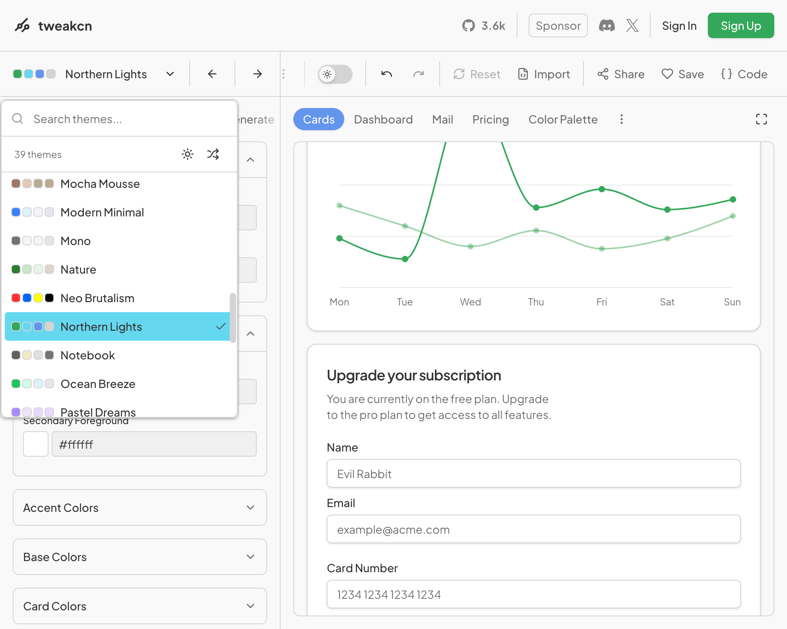
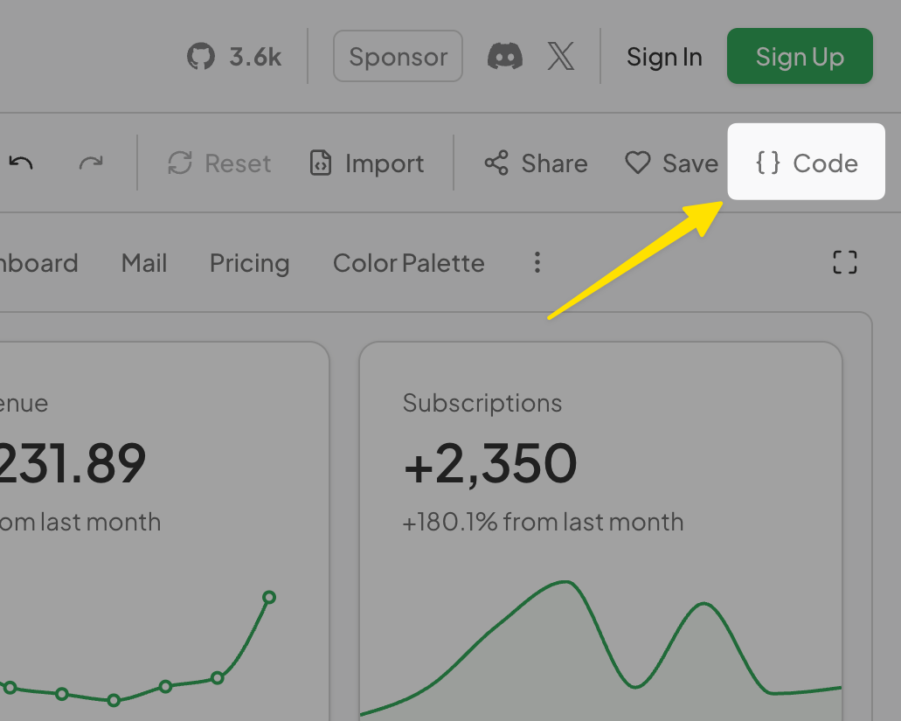
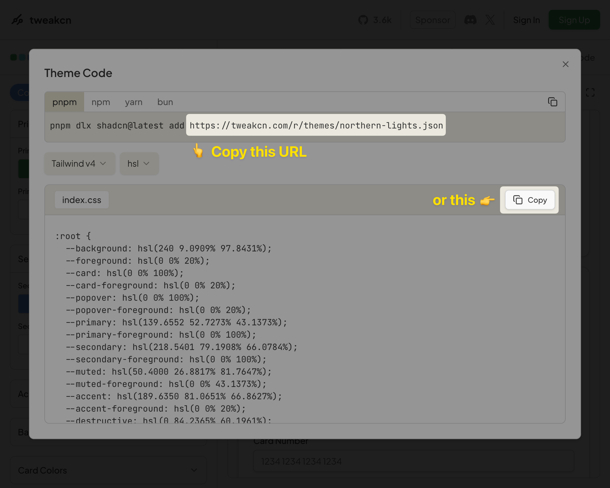
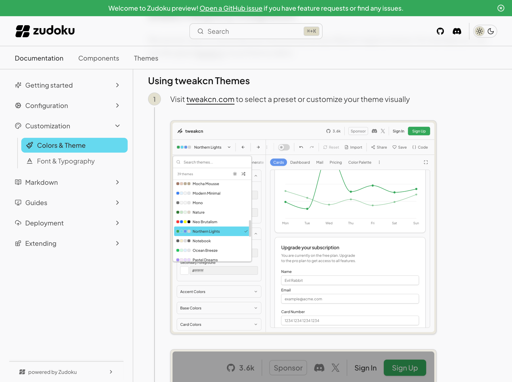

Zudoku provides flexible theming options allowing you to customize colors, import themes from [shadcn registries](https://ui.shadcn.com/docs/registry), and add custom CSS. You can create cohesive light and dark mode experiences that match your brand.

:::tip
Try out the interactive [Theme Playground](/theme-playground) to experiment with colors and see real-time previews of your theme changes.
:::

The theme system is built on [shadcn/ui theming](https://ui.shadcn.com/docs/theming) and [Tailwind v4](https://tailwindcss.com), giving us a great foundation to build upon:

- **CSS variables** match `shadcn/ui` conventions
- **Tailwind v4** CSS variable system for modern styling
- **Theme editors** like [tweakcn](https://tweakcn.com/) work out of the box
- **Shadcn registries** are supported

## Custom Colors

You can manually define colors for both light and dark modes, either by extending the [default theme](#default-theme) or creating a completely custom theme. Colors can be specified as hex values, RGB, HSL, OKLCH, etc. - basically anything that is supported by [Tailwind CSS](https://tailwindcss.com):

```ts title=zudoku.config.ts
const config = {
  theme: {
    light: {
      background: "#ffffff",
      foreground: "#020817",
      card: "#ffffff",
      cardForeground: "#020817",
      popover: "#ffffff",
      popoverForeground: "#020817",
      primary: "#0284c7",
      primaryForeground: "#ffffff",
      secondary: "#f1f5f9",
      secondaryForeground: "#020817",
      muted: "#f1f5f9",
      mutedForeground: "#64748b",
      accent: "#f1f5f9",
      accentForeground: "#020817",
      destructive: "#ef4444",
      destructiveForeground: "#ffffff",
      border: "#e2e8f0",
      input: "#e2e8f0",
      ring: "#0284c7",
      radius: "0.5rem",
    },
    dark: {
      background: "#020817",
      foreground: "#f8fafc",
      card: "#020817",
      cardForeground: "#f8fafc",
      popover: "#020817",
      popoverForeground: "#f8fafc",
      primary: "#0ea5e9",
      primaryForeground: "#f8fafc",
      secondary: "#1e293b",
      secondaryForeground: "#f8fafc",
      muted: "#1e293b",
      mutedForeground: "#94a3b8",
      accent: "#1e293b",
      accentForeground: "#f8fafc",
      destructive: "#ef4444",
      destructiveForeground: "#f8fafc",
      border: "#1e293b",
      input: "#1e293b",
      ring: "#0ea5e9",
      radius: "0.5rem",
    },
  },
};
```

## Available Theme Variables

| Variable                | Description                           |
| ----------------------- | ------------------------------------- |
| `background`            | Main background color                 |
| `foreground`            | Main text color                       |
| `card`                  | Card background color                 |
| `cardForeground`        | Card text color                       |
| `popover`               | Popover background color              |
| `popoverForeground`     | Popover text color                    |
| `primary`               | Primary action color                  |
| `primaryForeground`     | Text color on primary backgrounds     |
| `secondary`             | Secondary action color                |
| `secondaryForeground`   | Text color on secondary backgrounds   |
| `muted`                 | Muted/subtle background color         |
| `mutedForeground`       | Text color for muted elements         |
| `accent`                | Accent color for highlights           |
| `accentForeground`      | Text color on accent backgrounds      |
| `destructive`           | Color for destructive actions         |
| `destructiveForeground` | Text color on destructive backgrounds |
| `border`                | Border color                          |
| `input`                 | Input field border color              |
| `ring`                  | Focus ring color                      |
| `radius`                | Border radius value                   |

:::note

While shadcn/ui defines additional theme variables, Zudoku currently uses only these core variables.

:::

## shadcn Registry Integration

The easiest way to customize your theme is by using a Shadcn registry theme. For example you can use the great [tweakcn](https://tweakcn.com/) visual theme editor.

### Using tweakcn Themes

<Stepper>

1. Visit [tweakcn.com](https://tweakcn.com/) to select a preset or customize your theme visually

   <Framed align="start"></Framed>
   <Framed align="start"></Framed>

1. Copy the registry URL from the "Copy" section

   <Framed align="start"></Framed>

1. Add it to your configuration:
   ```ts title=zudoku.config.ts
   const config = {
     theme: {
       registryUrl: "https://tweakcn.com/r/themes/northern-lights.json",
     },
   };
   ```
1. The theme will then be automatically imported with all color variables, fonts, and styling configured for you 🚀

   <Framed align="start"></Framed>

</Stepper>

You can still override specific values if needed:

```ts title=zudoku.config.ts
const config = {
  theme: {
    registryUrl: "https://tweakcn.com/api/registry/theme/xyz123",
    // Override specific colors
    light: {
      primary: "#0066cc",
    },
    dark: {
      primary: "#3399ff",
    },
  },
};
```

Alternatively, you can copy the CSS code and paste it into your `customCss` configuration:

```ts title=zudoku.config.ts
const config = {
  theme: {
    customCss: `
      /* Copied CSS code */
    `,
  },
};
```

## Custom CSS

For advanced styling, you can add custom CSS either as a string or structured object:

### CSS String

```ts title=zudoku.config.ts
const config = {
  theme: {
    customCss: `
      .custom {
        background: linear-gradient(135deg, #667eea 0%, #764ba2 100%);
      }
    `,
  },
};
```

### CSS Object

```ts title=zudoku.config.ts
const config = {
  theme: {
    customCss: {
      ".custom": {
        background: "linear-gradient(135deg, #667eea 0%, #764ba2 100%)",
      },
    },
  },
};
```

## Default Theme

Zudoku comes with a built-in default theme based on [shadcn/ui zinc base colors](https://ui.shadcn.com/docs/theming#zinc). If you want to start completely from scratch without any default styling, you can disable the default theme:

```ts title=zudoku.config.ts
const config = {
  theme: {
    noDefaultTheme: true,
    // Your custom theme configuration
  },
};
```

When `noDefaultTheme` is set to `true`, no default colors or styling will be applied, giving you complete control over your theme.
Changing this requires to restart the development server.

## Complete Example

Here's a comprehensive example combining multiple theming approaches:

```ts title=zudoku.config.ts
const config = {
  theme: {
    // Import base theme from registry
    registryUrl: "https://tweakcn.com/api/registry/theme/modern-blue",

    // Override specific colors
    light: {
      primary: "#0066cc",
      accent: "#f0f9ff",
    },
    dark: {
      primary: "#3399ff",
      accent: "#0c1b2e",
    },

    // Custom fonts
    fonts: {
      sans: "Inter",
      mono: "JetBrains Mono",
    },

    // Additional custom styling
    customCss: {
      ".hero-section": {
        background: "var(--primary)",
        color: "var(--primary-foreground)",
        padding: "2rem",
        "border-radius": "var(--radius)",
      },
    },
  },
};
```

This configuration imports a base theme, customizes colors for both light and dark modes, sets fonts, and adds custom component styling.
