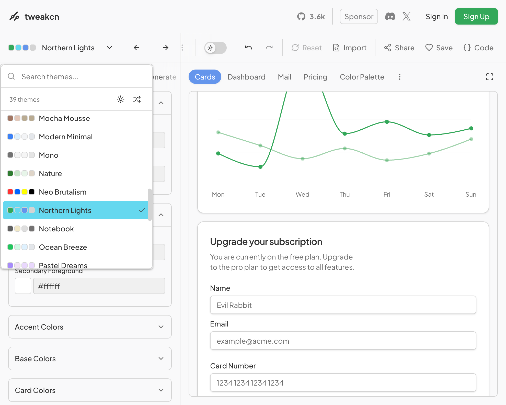
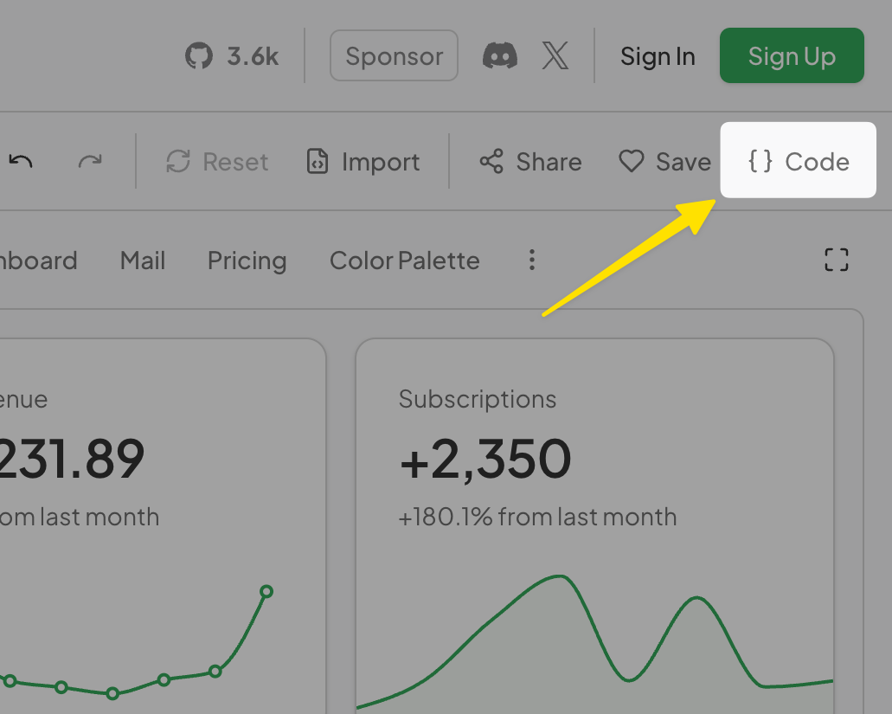
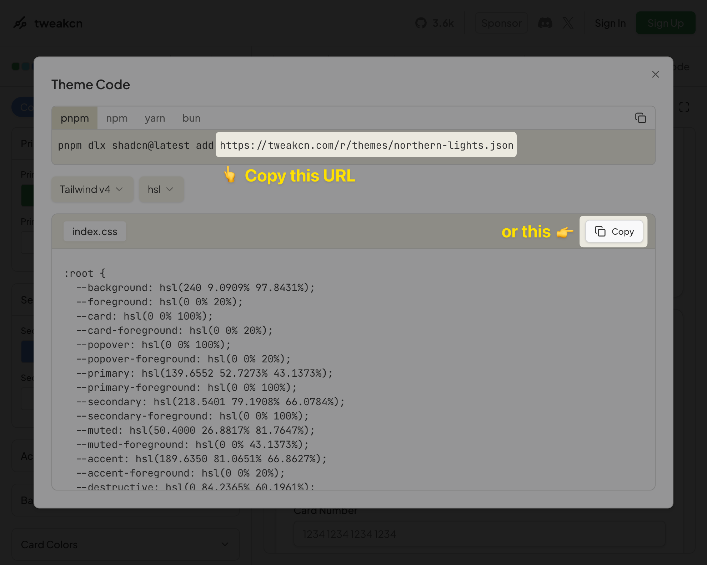
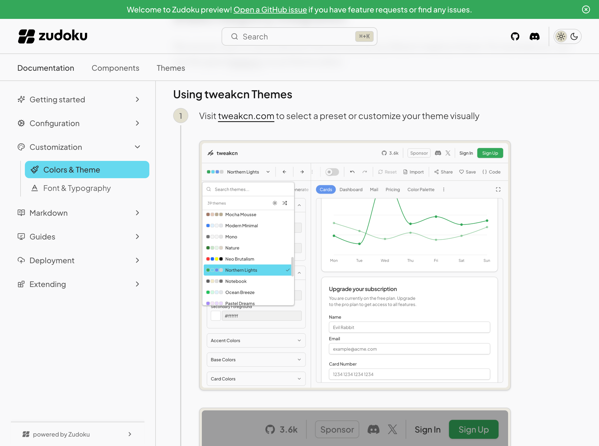

Zudoku provides flexible theming options allowing you to customize colors, import themes from
[shadcn registries](https://ui.shadcn.com/docs/registry), and add custom CSS. You can create
cohesive light and dark mode experiences that match your brand.

:::tip

Try out the interactive [Theme Playground](/docs/theme-playground) to experiment with colors and see
real-time previews of your theme changes.

:::

The theme system is built on [shadcn/ui theming](https://ui.shadcn.com/docs/theming) and
[Tailwind v4](https://tailwindcss.com), giving us a great foundation to build upon:

- **CSS variables** match `shadcn/ui` conventions
- **Tailwind v4** CSS variable system for modern styling
- **Theme editors** like [tweakcn](https://tweakcn.com/) work out of the box
- **Shadcn registries** are supported

## Custom Colors

You can manually define colors for both light and dark modes, either by extending the
[default theme](#default-theme) or creating a completely custom theme. Colors can be specified as
hex values, RGB, HSL, OKLCH, etc. - basically anything that is supported by
[Tailwind CSS](https://tailwindcss.com):

```ts title=zudoku.config.ts
const config = {
  theme: {
    light: {
      background: "#ffffff",
      foreground: "#020817",
      card: "#ffffff",
      cardForeground: "#020817",
      popover: "#ffffff",
      popoverForeground: "#020817",
      primary: "#0284c7",
      primaryForeground: "#ffffff",
      secondary: "#f1f5f9",
      secondaryForeground: "#020817",
      muted: "#f1f5f9",
      mutedForeground: "#64748b",
      accent: "#f1f5f9",
      accentForeground: "#020817",
      destructive: "#ef4444",
      destructiveForeground: "#ffffff",
      border: "#e2e8f0",
      input: "#e2e8f0",
      ring: "#0284c7",
      radius: "0.5rem",
    },
    dark: {
      background: "#020817",
      foreground: "#f8fafc",
      card: "#020817",
      cardForeground: "#f8fafc",
      popover: "#020817",
      popoverForeground: "#f8fafc",
      primary: "#0ea5e9",
      primaryForeground: "#f8fafc",
      secondary: "#1e293b",
      secondaryForeground: "#f8fafc",
      muted: "#1e293b",
      mutedForeground: "#94a3b8",
      accent: "#1e293b",
      accentForeground: "#f8fafc",
      destructive: "#ef4444",
      destructiveForeground: "#f8fafc",
      border: "#1e293b",
      input: "#1e293b",
      ring: "#0ea5e9",
      radius: "0.5rem",
    },
  },
};
```

## Available Theme Variables

| Variable                | Description                           |
| ----------------------- | ------------------------------------- |
| `background`            | Main background color                 |
| `foreground`            | Main text color                       |
| `card`                  | Card background color                 |
| `cardForeground`        | Card text color                       |
| `popover`               | Popover background color              |
| `popoverForeground`     | Popover text color                    |
| `primary`               | Primary action color                  |
| `primaryForeground`     | Text color on primary backgrounds     |
| `secondary`             | Secondary action color                |
| `secondaryForeground`   | Text color on secondary backgrounds   |
| `muted`                 | Muted/subtle background color         |
| `mutedForeground`       | Text color for muted elements         |
| `accent`                | Accent color for highlights           |
| `accentForeground`      | Text color on accent backgrounds      |
| `destructive`           | Color for destructive actions         |
| `destructiveForeground` | Text color on destructive backgrounds |
| `border`                | Border color                          |
| `input`                 | Input field border color              |
| `ring`                  | Focus ring color                      |
| `radius`                | Border radius value                   |

:::note

While shadcn/ui defines additional theme variables, Zudoku currently uses only these core variables.

:::

## Badge Colors

Navigation badges and the HTTP method labels on OpenAPI pages share one palette of seven CSS
variables. Each token is used for both badge styles: as the text color of a label, and as the
background of a filled badge with a `--background`-colored label.

| Variable         | Used for              |
| ---------------- | --------------------- |
| `--badge-green`  | `GET`                 |
| `--badge-blue`   | `POST`                |
| `--badge-yellow` | `PUT`                 |
| `--badge-red`    | `DELETE`              |
| `--badge-purple` | `PATCH`               |
| `--badge-indigo` | `OPTIONS`, MCP badges |
| `--badge-gray`   | `HEAD`, `TRACE`       |

These are CSS variables rather than `theme` config keys, so set them through
[`customCss`](#custom-css) or your own stylesheet. Like the other theme colors, they're defined
separately for light and dark mode:

```ts title=zudoku.config.ts
const config = {
  theme: {
    customCss: {
      ":root": {
        "--badge-green": "oklch(45% 0.13 160)",
      },
      ".dark": {
        "--badge-green": "oklch(75% 0.18 160)",
      },
    },
  },
};
```

To keep badges readable, pick each color so it reaches a contrast ratio of at least 4.5:1 against
your `--background` in that mode. Contrast works the same in both directions, so that one check
covers both styles: a dark color on a light page, and a light page color on a dark badge. In
practice that means a dark shade in light mode and a light shade in dark mode.

Badges also accept a `color` of `outline`, which uses `--border` and `--foreground` instead of the
palette.

### Badge colors with `noDefaultTheme`

The badge tokens are part of the default theme. If you set [`noDefaultTheme`](#default-theme), you
need to define all seven yourself, for both light and dark mode.

:::caution

Without them, badges render with no color: text badges take the color of the surrounding text, and
filled badges become invisible, because their label is your background color on a transparent fill.

:::

The build warns if any of the seven are missing from your CSS.

To keep the default palette, copy these values into your stylesheet or `customCss`:

```css
:root {
  --badge-green: oklch(44.8% 0.119 151.328);
  --badge-blue: oklch(50% 0.134 242.749);
  --badge-yellow: oklch(47.6% 0.114 61.907);
  --badge-red: oklch(50.5% 0.213 27.518);
  --badge-purple: oklch(55.8% 0.288 302.321);
  --badge-indigo: oklch(51.1% 0.262 276.966);
  --badge-gray: oklch(44.6% 0.03 256.802);
}

.dark {
  --badge-green: oklch(72.3% 0.219 149.579);
  --badge-blue: oklch(68.5% 0.169 237.323);
  --badge-yellow: oklch(79.5% 0.184 86.047);
  --badge-red: oklch(70.4% 0.191 22.216);
  --badge-purple: oklch(71.4% 0.203 305.504);
  --badge-indigo: oklch(67.3% 0.182 276.935);
  --badge-gray: oklch(70.7% 0.022 261.325);
}
```

## shadcn Registry Integration

The easiest way to customize your theme is by using a Shadcn registry theme. For example you can use
the great [tweakcn](https://tweakcn.com/) visual theme editor.

### Using tweakcn Themes

<Stepper>

1. Visit [tweakcn.com](https://tweakcn.com/) to select a preset or customize your theme visually

   <Framed align="start"></Framed>
   <Framed align="start"></Framed>

1. Copy the registry URL from the "Copy" section

   <Framed align="start"></Framed>

1. Add it to your configuration:
   ```ts title=zudoku.config.ts
   const config = {
     theme: {
       registryUrl: "https://tweakcn.com/r/themes/northern-lights.json",
     },
   };
   ```
1. The theme will then be automatically imported with all color variables, fonts, and styling
   configured for you 🚀

   <Framed align="start"></Framed>

</Stepper>

You can still override specific values if needed:

```ts title=zudoku.config.ts
const config = {
  theme: {
    registryUrl: "https://tweakcn.com/api/registry/theme/xyz123",
    // Override specific colors
    light: {
      primary: "#0066cc",
    },
    dark: {
      primary: "#3399ff",
    },
  },
};
```

Alternatively, paste the copied CSS into a stylesheet and import it from your config:

```css title=styles.css
/* Copied CSS code */
```

```ts title=zudoku.config.ts
import "./styles.css";
```

## Custom CSS

The recommended way to add custom styles is to write a `.css` file alongside your config and import
it. This gives you HMR during development, syntax highlighting, autocompletion, and lets you split
styles across files as your site grows.

```css title=styles.css
.custom {
  background: linear-gradient(135deg, #667eea 0%, #764ba2 100%);
}
```

```ts title=zudoku.config.ts
import "./styles.css";

const config = {
  // ...
};
```

If TypeScript reports `Cannot find module './styles.css'`, add `zudoku/client` to your tsconfig
types so CSS side-effect imports are recognized:

```json title=tsconfig.json
{
  "compilerOptions": {
    "types": ["zudoku/client"]
  }
}
```

Projects created with `create-zudoku` include this by default.

### Inline alternatives (deprecated)

The `theme.customCss` option is deprecated and will be removed in a future release. It still accepts
a CSS string or object for backwards compatibility, but every change requires restarting the dev
server and you lose syntax highlighting, autocompletion, and HMR. Migrate to an imported `.css`
file.

```ts title=zudoku.config.ts
const config = {
  theme: {
    customCss: `
      .custom {
        background: linear-gradient(135deg, #667eea 0%, #764ba2 100%);
      }
    `,
  },
};
```

### Enabling Code Ligatures

Zudoku disables ligatures in code blocks by default to avoid unwanted glyph joining in fonts like
Geist Mono (e.g. `---`, `###`, `|--|`). If you're using a coding font designed around ligatures
(Fira Code, JetBrains Mono, etc.), re-enable them in your CSS file:

```css title=styles.css
code,
pre,
kbd,
samp,
.shiki,
.shiki span {
  font-variant-ligatures: normal;
  font-feature-settings: normal;
}
```

## Default Theme

Zudoku comes with a built-in default theme based on
[shadcn/ui zinc base colors](https://ui.shadcn.com/docs/theming#zinc). If you want to start
completely from scratch without any default styling, you can disable the default theme:

```ts title=zudoku.config.ts
const config = {
  theme: {
    noDefaultTheme: true,
    // Your custom theme configuration
  },
};
```

When `noDefaultTheme` is set to `true`, no default colors or styling will be applied, giving you
complete control over your theme. Changing this requires to restart the development server.

This includes the [badge colors](#badge-colors-with-nodefaulttheme) used for navigation badges and
HTTP method labels: define the `--badge-*` tokens yourself, or those badges render without color.

## Complete Example

Here's a comprehensive example combining multiple theming approaches:

```ts title=zudoku.config.ts
const config = {
  theme: {
    // Import base theme from registry
    registryUrl: "https://tweakcn.com/api/registry/theme/modern-blue",

    // Override specific colors
    light: {
      primary: "#0066cc",
      accent: "#f0f9ff",
    },
    dark: {
      primary: "#3399ff",
      accent: "#0c1b2e",
    },

    // Custom fonts
    fonts: {
      sans: "Inter",
      mono: "JetBrains Mono",
    },

    // Additional custom styling
    customCss: {
      ".hero-section": {
        background: "var(--primary)",
        color: "var(--primary-foreground)",
        padding: "2rem",
        "border-radius": "var(--radius)",
      },
    },
  },
};
```

This configuration imports a base theme, customizes colors for both light and dark modes, sets
fonts, and adds custom component styling.
