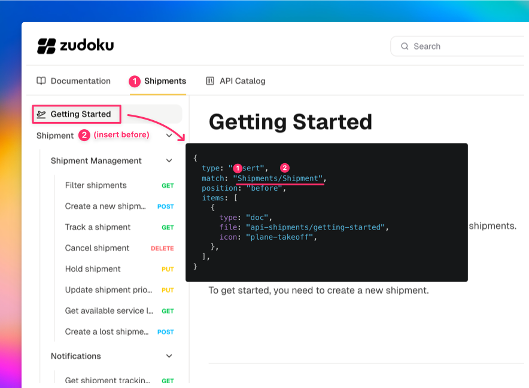
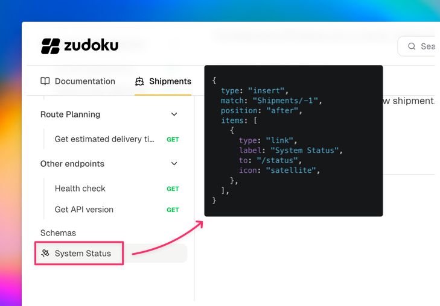
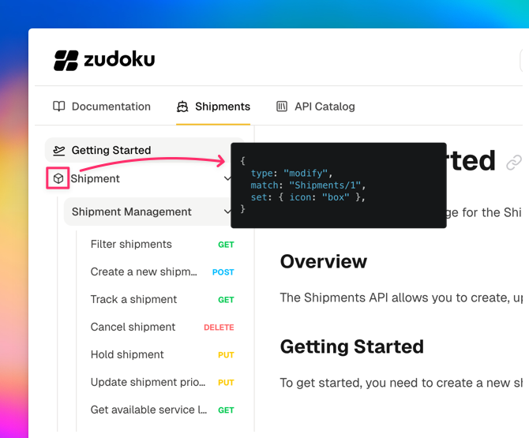

import { LayersPlusIcon, PencilIcon, SortAscIcon, ArrowUpDownIcon, TrashIcon } from "zudoku/icons";

Plugins like the OpenAPI plugin generate sidebar navigation automatically. Navigation rules let you
customize that generated sidebar without changing the source. You can:

- <LayersPlusIcon className="inline-block size-3.5 me-1" /> **Insert** items at a specific position
- <PencilIcon className="inline-block size-3.5 me-1" /> **Modify** items
- <SortAscIcon className="inline-block size-3.5 me-1" /> **Sort** items with a custom comparator
- <ArrowUpDownIcon className="inline-block size-3.5 me-1" /> **Move** items to a different position
- <TrashIcon className="inline-block size-3.5 me-1" /> **Remove** items

## Setup

Add a `navigationRules` array to your `zudoku.config.tsx`:

```tsx
import type { ZudokuConfig } from "zudoku";

const config: ZudokuConfig = {
  apis: [{ type: "file", input: "./api.json", path: "api-shipments" }],
  navigation: [{ type: "link", label: "Shipments", to: "/api-shipments" }],
  navigationRules: [
    // rules go here
  ],
};
```

## Inserting docs

Use `type: "insert"` to add items before or after a matched sidebar item. The `match` string uses
the tab label as the first segment and navigates into the sidebar tree.

```tsx
navigationRules: [
  {
    type: "insert",
    match: "Shipments/0",
    position: "before",
    items: [
      {
        type: "doc",
        file: "api-shipments/getting-started",
        icon: "plane-takeoff",
      },
    ],
  },
],
```

This inserts a "Getting Started" doc before the first item in the Shipments sidebar.



The MDX file lives at `pages/api-shipments/getting-started.mdx` (under your configured docs
directory, matching the API's base path).

## Adding links

You can insert external or internal links the same way:

```tsx
{
  type: "insert",
  match: "Shipments/-1",
  position: "after",
  items: [
    {
      type: "link",
      label: "System Status",
      to: "/status",
      icon: "satellite",
    },
  ],
}
```

The `-1` index targets the last item, and `position: "after"` places the link at the very end of the
sidebar.



## Modifying items

Use `type: "modify"` to change properties of existing sidebar items like their icon, label, or
collapsed state:

```tsx
{
  type: "modify",
  match: "Shipments/Shipment Management",
  set: { icon: "box", collapsed: true },
}
```



## Removing items

`type: "remove"` hides items from the sidebar. This is rarely needed since it's usually better to
fix the underlying source, but can be useful as a quick workaround:

```tsx
{
  type: "remove",
  match: "Shipments/Deprecated Endpoint",
}
```

## Sorting items

Use `type: "sort"` to reorder children of a category alphabetically or with any custom comparator:

```tsx
{
  type: "sort",
  match: "Shipments",
  by: (a, b) => a.label.localeCompare(b.label),
}
```

The `by` function receives two navigation items and works like a standard `Array.sort` comparator.

## Moving items

Use `type: "move"` to relocate an existing item to a different position in the sidebar:

```tsx
{
  type: "move",
  match: "Shipments/Track a Shipment",
  to: "Shipments/0",
  position: "before",
}
```

This moves "Track a Shipment" to the top of the Shipments category. You can also move items between
different levels, for example from inside a category to the root level.

## Rule order

Rules are applied sequentially, so order matters. For example, sorting first and then inserting
places the new item at an exact position in the already-sorted list. Inserting first and then
sorting will sort the new item along with everything else.

## Complete example

This is the configuration used in the Cosmo Cargo demo shown above:

```tsx
navigationRules: [
  {
    type: "sort",
    match: "Shipments",
    by: (a, b) => a.label.localeCompare(b.label),
  },
  {
    type: "insert",
    match: "Shipments/Shipment",
    position: "before",
    items: [
      {
        type: "doc",
        file: "api-shipments/getting-started",
        icon: "plane-takeoff",
      },
    ],
  },
  {
    type: "insert",
    match: "Shipments/-1",
    position: "after",
    items: [
      {
        type: "link",
        label: "System Status",
        to: "/status",
        icon: "satellite",
      },
    ],
  },
  {
    type: "modify",
    match: "Shipments/1",
    set: { icon: "box" },
  },
],
```

## Match syntax reference

For the full match syntax including label matching, index selectors, and nested paths, see the
[Navigation Rules reference](/docs/configuration/navigation#navigation-rules).
