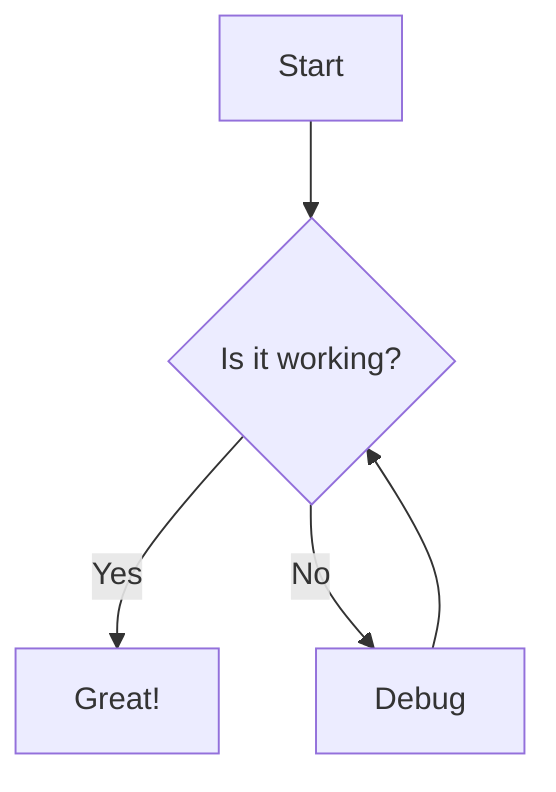
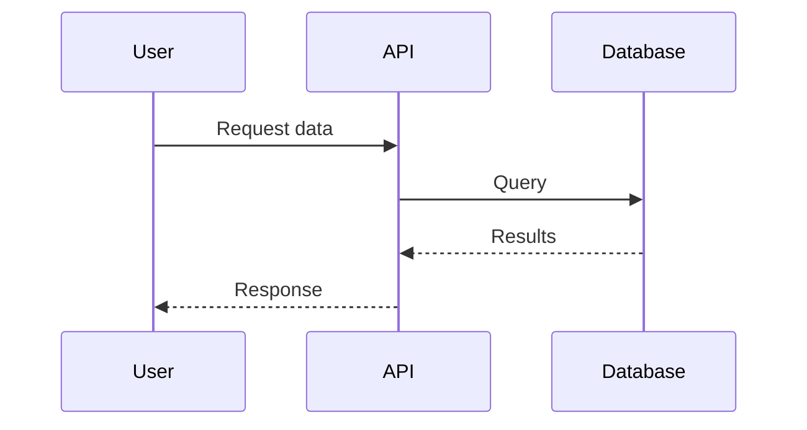

## Installation

Mermaid support is **opt-in** to keep Zudoku lightweight. Install only what you need:

### Client-Side Rendering (Recommended)

For client-side rendering (diagrams render in the browser):

```bash
npm install mermaid
```

**That's it!** Just one lightweight package (~400KB). No build-time dependencies, no Playwright.

### Server-Side Rendering (Optional)

For server-side rendering (diagrams pre-rendered at build time):

```bash
npm install rehype-mermaid
npm install -D playwright
npx playwright install chromium
```

:::note{title="Why is Client-Side So Simple Now?"}

Zudoku includes a **lightweight built-in plugin** for client-side mermaid rendering that has zero
dependencies.

For client-side (`pre-mermaid` strategy), you only need:

- **`mermaid`** - The browser library that renders diagrams (~400KB)

For server-side rendering, Zudoku uses the full `rehype-mermaid` plugin which:

- Requires **`rehype-mermaid`** + **`playwright`** (~80MB) for build-time rendering
- Pre-renders diagrams as SVG/PNG at build time

:::

## Quick Start

### Step 1: Configure the Rehype Plugin

Create or edit `zudoku.build.ts` in your project root:

```typescript
import { mermaidRehypePlugin } from "zudoku/mermaid";

export default {
  rehypePlugins: [
    // Client-side rendering (default, lightweight)
    await mermaidRehypePlugin(),

    // Inline SVG (recommended for server-side)
    // await mermaidRehypePlugin({ strategy: "inline-svg" }),

    // Or use SVG images (server-side)
    // await mermaidRehypePlugin({ strategy: "img-svg" }),

    // Or use PNG images (server-side)
    // await mermaidRehypePlugin({ strategy: "img-png" }),
  ],
};
```

### Step 2: Add Client-Side Initializer (Client-Side Only)

If using client-side rendering, add the initializer to your `zudoku.config.tsx`:

```typescript
import { MermaidInitializer } from "zudoku/mermaid";
import type { ZudokuConfig } from "zudoku";

const config: ZudokuConfig = {
  // ... your other config
  plugins: [
    {
      getMdxComponents: () => ({
        wrapper: ({ children }) => (
          <>
            <MermaidInitializer />
            {children}
          </>
        ),
      }),
    },
  ],
};

export default config;
```

### Step 3: Use Mermaid in Your MDX

Now you can use Mermaid diagrams in any `.mdx` file:

````markdown
# My Documentation

Here's a flowchart:



And a sequence diagram:


````

## Advanced Configuration

### Custom Mermaid Configuration

#### For Client-Side Rendering

Mermaid configuration for client-side rendering is passed to the `<MermaidInitializer>` component:

```typescript
import { MermaidInitializer } from "zudoku/mermaid";

export default {
  plugins: [
    {
      getMdxComponents: () => ({
        wrapper: ({ children }) => (
          <>
            <MermaidInitializer
              config={{
                theme: "dark",
                flowchart: {
                  curve: "basis",
                  padding: 20,
                },
                sequence: {
                  actorMargin: 50,
                },
              }}
            />
            {children}
          </>
        ),
      }),
    },
  ],
};
```

#### For Server-Side Rendering

For server-side rendering strategies, pass configuration to the rehype plugin:

```typescript
import { mermaidRehypePlugin } from "zudoku/mermaid";

export default {
  rehypePlugins: [
    await mermaidRehypePlugin({
      strategy: "inline-svg", // or "img-svg" or "img-png"
      mermaidConfig: {
        theme: "dark",
        flowchart: {
          curve: "basis",
          padding: 20,
        },
      },
    }),
  ],
};
```

### Theme Integration

Integrate with Zudoku's theme system:

```typescript
import { MermaidInitializer } from "zudoku/mermaid";
import { useTheme } from "zudoku/hooks";

const MermaidWithTheme = () => {
  const { resolvedTheme } = useTheme();

  // Use resolvedTheme to handle "system" theme preference
  // Falls back to "default" if theme is undefined (e.g., on server)
  const isDark = resolvedTheme === "dark";

  return (
    <MermaidInitializer
      darkMode={isDark}
      config={{
        theme: isDark ? "dark" : "default",
      }}
    />
  );
};

// Add to your config
export default {
  plugins: [
    {
      getMdxComponents: () => ({
        wrapper: ({ children }) => (
          <>
            <MermaidWithTheme />
            {children}
          </>
        ),
      }),
    },
  ],
};
```

## Supported Diagram Types

Mermaid supports many diagram types:

See [Mermaid documentation](https://mermaid.js.org/intro/) for all diagram types and syntax.
