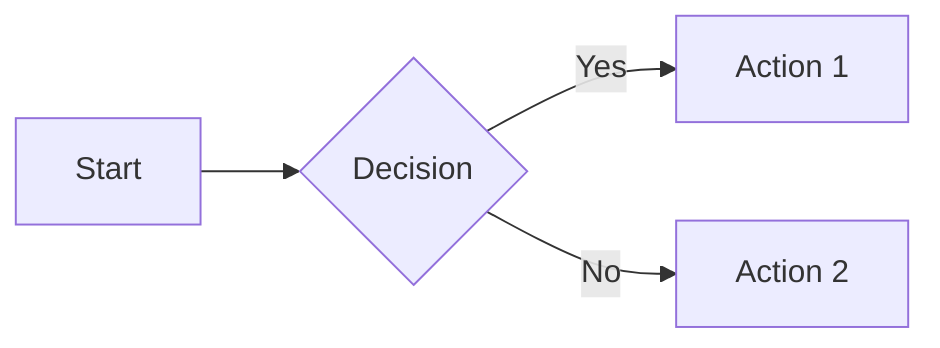
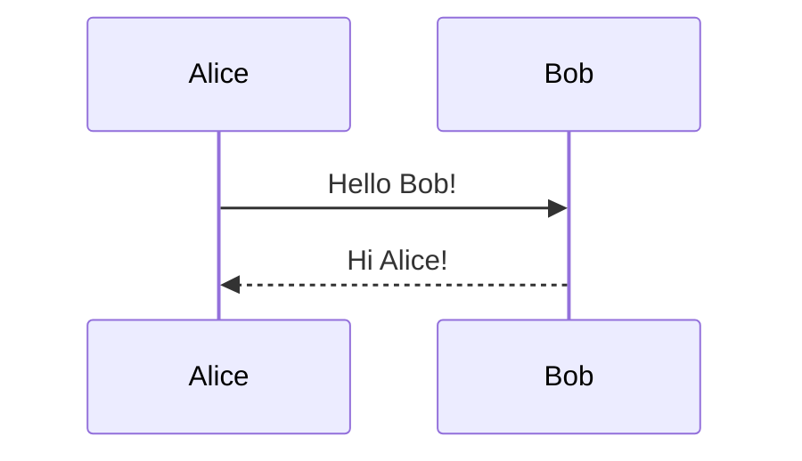
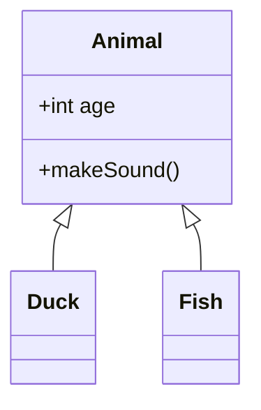
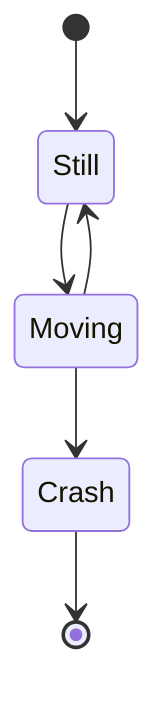
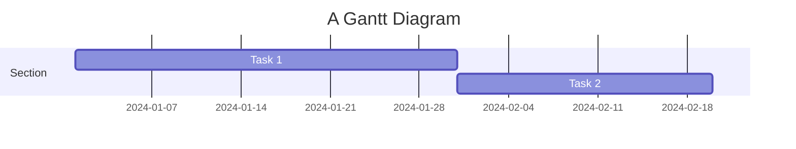

# Mermaid Diagrams

Zudoku supports [Mermaid](https://mermaid.js.org/) diagrams in your MDX documentation. Mermaid lets
you create diagrams and visualizations using text and code.

## Usage

To add a Mermaid diagram to your documentation, use a code block with the `mermaid` language
identifier:

````markdown

````

## Supported Diagram Types

Mermaid supports many diagram types:

### Flowcharts



### Sequence Diagrams



### Class Diagrams



### State Diagrams



### Gantt Charts



## Configuration

All diagrams are rendered to static SVG at build time, providing optimal performance. The Mermaid
syntax is processed during the build phase, eliminating the need for client-side JavaScript.

## Learn More

For complete Mermaid syntax and examples, visit:

- [Mermaid Official Documentation](https://mermaid.js.org/)
- [Mermaid Live Editor](https://mermaid.live/) - Interactive editor to test diagrams
