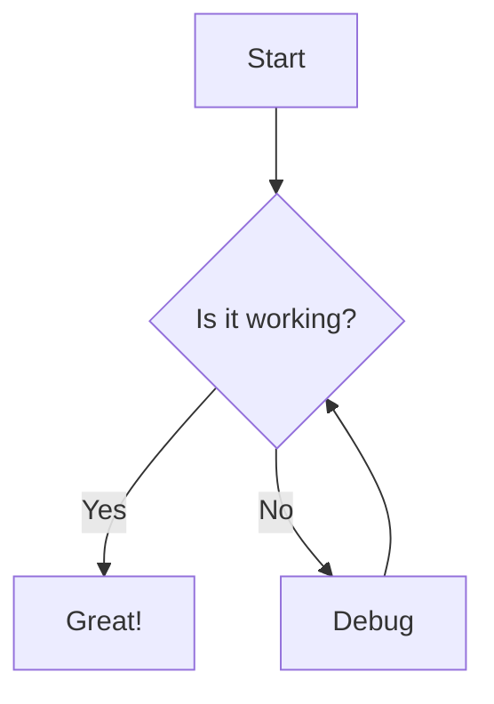
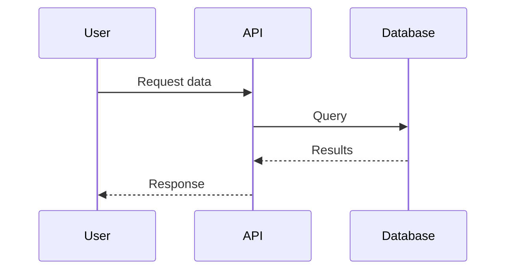

## Installation

Mermaid support is **opt-in** to keep Zudoku lightweight. Install only what you need:

### Client-Side Rendering (Recommended)

For client-side rendering (diagrams render in the browser):

```bash
npm install mermaid
```

**That's it!** Just one lightweight package (~400KB). No build-time dependencies, no Playwright.

### Server-Side Rendering (Optional)

For server-side rendering (diagrams pre-rendered at build time):

```bash
npm install rehype-mermaid
npm install -D playwright
npx playwright install chromium
```

:::note{title="Why is Client-Side So Simple Now?"}

Zudoku includes a **lightweight built-in plugin** for client-side mermaid rendering that has zero
dependencies.

For client-side (`pre-mermaid` strategy), you only need:

- **`mermaid`** - The browser library that renders diagrams (~400KB)

For server-side rendering, Zudoku uses the full `rehype-mermaid` plugin which:

- Requires **`rehype-mermaid`** + **`playwright`** (~80MB) for build-time rendering
- Pre-renders diagrams as SVG/PNG at build time

:::

## How It Works

Zudoku uses **two different plugins** depending on your rendering strategy:

### Client-Side Rendering (Default)

For `pre-mermaid` strategy, Zudoku uses a **lightweight built-in plugin** (`rehype-mermaid-client`)
with zero dependencies:

1. **Markdown Parsing** - MDX files are parsed into an Abstract Syntax Tree (AST)
2. **Remark Plugins** - Process the Markdown AST (before HTML conversion)
3. **HTML Conversion** - Markdown is converted to HTML
4. **Rehype Plugins** - Process the HTML AST (after conversion)
   - **Mermaid Preprocessor** - Marks mermaid blocks to skip syntax highlighting
   - **Shiki** - Syntax highlights code blocks (skips marked mermaid blocks)
   - **Mermaid Postprocessor** - Restores mermaid classes
   - **rehype-mermaid-client** - Transforms blocks for browser rendering
5. **Browser Rendering** - MermaidInitializer component renders diagrams using mermaid.js

The lightweight plugin simply transforms:

```html
<pre><code class="language-mermaid">graph TD...</code></pre>
```

Into:

```html
<pre class="mermaid">graph TD...</pre>
```

This format is what mermaid.js expects in the browser. **No heavyweight dependencies needed!**

### Server-Side Rendering

For `inline-svg`, `img-svg`, or `img-png` strategies, Zudoku uses the full `rehype-mermaid` plugin
which renders diagrams at build time using Playwright.

### Shiki Integration

Zudoku uses [Shiki](https://shiki.style/) for syntax highlighting. To prevent Shiki from
syntax-highlighting mermaid code blocks (which would prevent diagram rendering), the implementation
includes:

- **`rehypeMermaidPreprocessor`** - Runs before Shiki, temporarily removes the `language-mermaid`
  class and marks blocks with `data-mermaid="true"`
- **`rehypeMermaidPostprocessor`** - Runs after Shiki, restores the `language-mermaid` class for the
  mermaid plugin to process

This ensures mermaid blocks are preserved intact through the pipeline and rendered as diagrams
instead of highlighted code.

## Quick Start

### Step 1: Configure the Rehype Plugin

Create or edit `zudoku.build.ts` in your project root:

```typescript
import { mermaidRehypePlugin } from "zudoku/mermaid";

export default {
  rehypePlugins: [
    // Client-side rendering (default, lightweight)
    await mermaidRehypePlugin(),

    // Inline SVG (recommended for server-side)
    // await mermaidRehypePlugin({ strategy: "inline-svg" }),

    // Or use SVG images (server-side)
    // await mermaidRehypePlugin({ strategy: "img-svg" }),

    // Or use PNG images (server-side)
    // await mermaidRehypePlugin({ strategy: "img-png" }),
  ],
};
```

### Step 2: Add Client-Side Initializer (Client-Side Only)

If using client-side rendering, add the initializer to your `zudoku.config.tsx`:

```typescript
import { MermaidInitializer } from "zudoku/mermaid";
import type { ZudokuConfig } from "zudoku";

const config: ZudokuConfig = {
  // ... your other config
  plugins: [
    {
      getMdxComponents: () => ({
        wrapper: ({ children }) => (
          <>
            <MermaidInitializer />
            {children}
          </>
        ),
      }),
    },
  ],
};

export default config;
```

### Step 3: Use Mermaid in Your MDX

Now you can use Mermaid diagrams in any `.mdx` file:

````markdown
# My Documentation

Here's a flowchart:


```mermaid
graph TD
    A[Start] --> B{Is it working?}
    B -->|Yes| C[Great!]
    B -->|No| D[Debug]
    D --> B
```

And a sequence diagram:


```mermaid
sequenceDiagram
    participant User
    participant API
    participant Database

    User->>API: Request data
    API->>Database: Query
    Database-->>API: Results
    API-->>User: Response
```
````

## Advanced Configuration

### Custom Mermaid Configuration

```typescript
import { mermaidRehypePlugin } from "zudoku/mermaid";

export default {
  rehypePlugins: [
    await mermaidRehypePlugin({
      strategy: "pre-mermaid",
      mermaidConfig: {
        theme: "dark",
        flowchart: {
          curve: "basis",
          padding: 20,
        },
        sequence: {
          actorMargin: 50,
        },
      },
    }),
  ],
};
```

### Using Presets

```typescript
import { MermaidPresets } from "zudoku/mermaid";

export default {
  rehypePlugins: [
    // Client-side with default theme
    await MermaidPresets.clientSide(),

    // Client-side with dark theme
    // await MermaidPresets.clientSideDark(),

    // Server-side inline SVG
    // await MermaidPresets.serverSideInlineSvg(),

    // Server-side SVG images
    // await MermaidPresets.serverSideSvgImage(),

    // Server-side PNG images
    // await MermaidPresets.serverSidePngImage(),
  ],
};
```

### Theme Integration

Integrate with Zudoku's theme system:

```typescript
import { MermaidInitializer } from "zudoku/mermaid";
import { useTheme } from "zudoku/hooks";

const MermaidWithTheme = () => {
  const { resolvedTheme } = useTheme();

  // Use resolvedTheme to handle "system" theme preference
  // Falls back to "default" if theme is undefined (e.g., on server)
  const isDark = resolvedTheme === "dark";

  return (
    <MermaidInitializer
      darkMode={isDark}
      config={{
        theme: isDark ? "dark" : "default",
      }}
    />
  );
};

// Add to your config
export default {
  plugins: [
    {
      getMdxComponents: () => ({
        wrapper: ({ children }) => (
          <>
            <MermaidWithTheme />
            {children}
          </>
        ),
      }),
    },
  ],
};
```

## Supported Diagram Types

Mermaid supports many diagram types:

See [Mermaid documentation](https://mermaid.js.org/intro/) for all diagram types and syntax.
