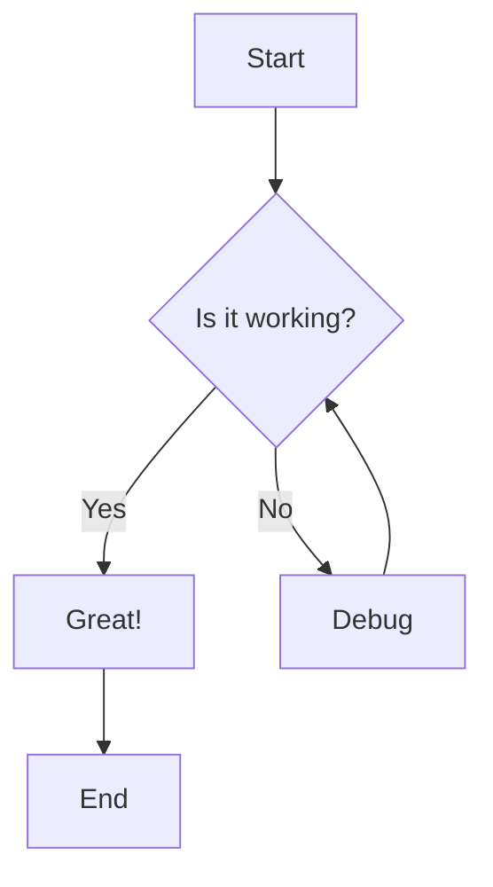
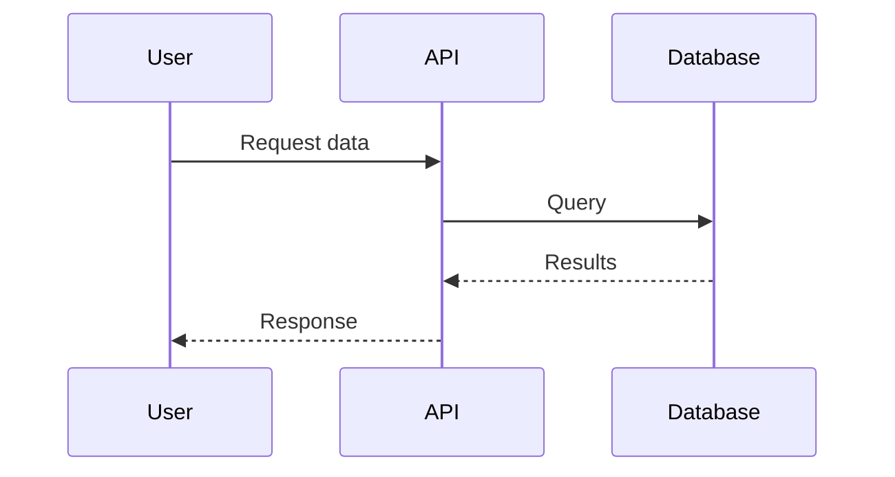
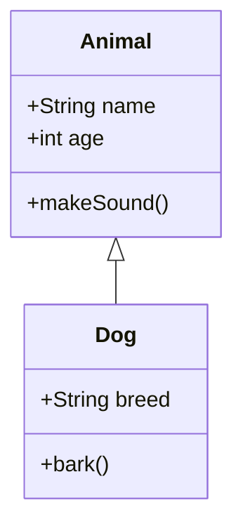
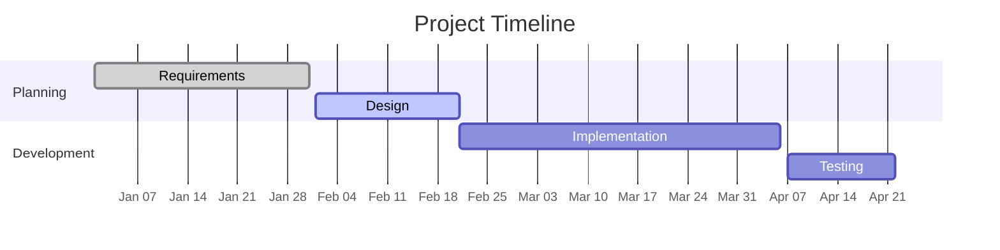
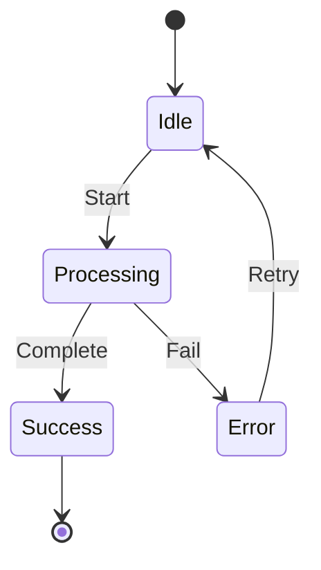

# Mermaid Diagrams

This page demonstrates Mermaid diagram support in Zudoku. You can create various types of diagrams
using Mermaid syntax in code blocks.

## Flowchart Example

A simple flowchart showing a decision tree:

## Sequence Diagram

Visualize API interactions between different actors:

## Class Diagram

Display object-oriented class structures:

## Gantt Chart

Project timeline visualization:

## State Diagram

Model state transitions:

